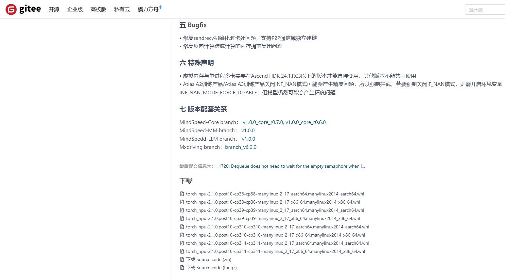
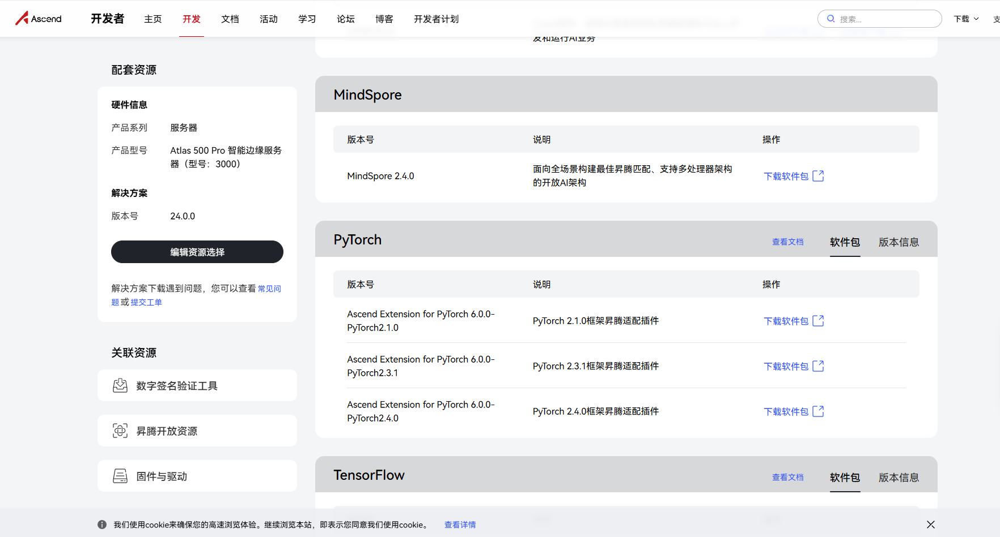
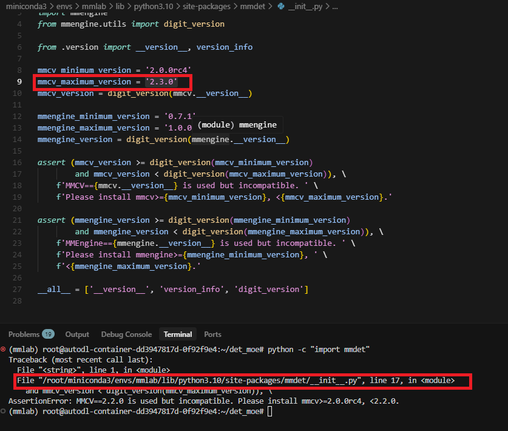
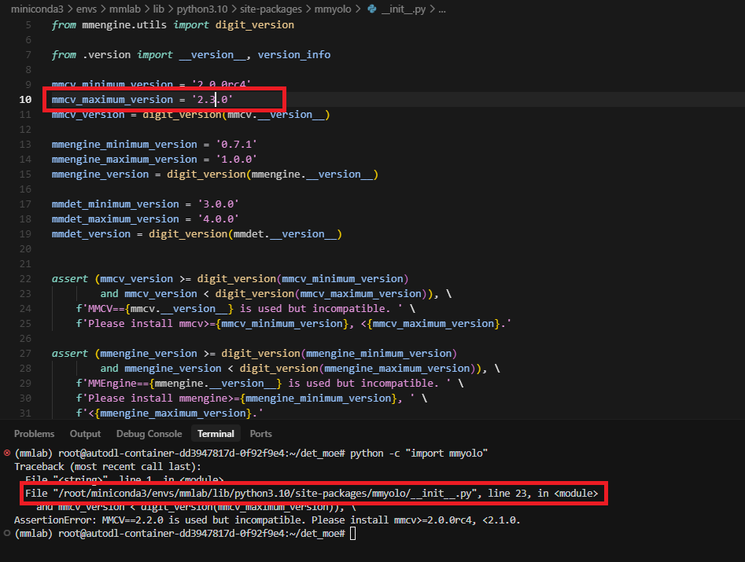

# 华为昇腾NPU环境配置

## 硬件配置

|CPU|NPU|
|-|-|
|鲲鹏920|昇腾910B2|

## 驱动/CANN异构计算框架

配置环境需要预先安装NPU驱动程序和CANN异构计算框架（相当于NVIDIA环境下的显卡驱动与CUDA框架）

直接根据昇腾官方文档进行安装，此处不进行赘述：
https://www.hiascend.com/document/detail/zh/canncommercial/800/softwareinst/instg/instg_0000.html?Mode=PmIns&OS=Ubuntu&Software=cannToolKit

后续安装步骤以CANN 8.0.0版本为基础，其他版本请相应修改版本控制参数。

## Conda虚拟环境创建（可选）

可以通过conda创建虚拟环境，方式与GPU环境下的创建相同。

```bash
conda create -n mmlab python=3.10 -y
conda activate mmlab
```

## Pytorch安装（以2.1.0为例）

在NPU环境下安装Pytorch，需要先安装CPU版本的Pytorch，然后再附加安装昇腾适配插件。

```bash
pip install torch==2.1.0 torchvision==0.16.0 torchaudio==2.1.0 --index-url https://download.pytorch.org/whl/cpu
```

从昇腾官方仓库下载针对torch==2.1.0版本的昇腾适配插件，下载链接：https://gitee.com/ascend/pytorch/releases/tag/v7.1.0-pytorch2.1.0



此处需要根据CPU架构以及python版本选择下载的文件。以python==3.10为例，鲲鹏920的架构是aarch64，因此选择下载：[torch_npu-2.1.0.post10-cp310-cp310-manylinux_2_17_aarch64.manylinux2014_aarch64.whl](https://gitee.com/ascend/pytorch/releases/download/v6.0.0-pytorch2.1.0/torch_npu-2.1.0.post10-cp310-cp310-manylinux_2_17_aarch64.manylinux2014_aarch64.whl)

对于其他版本的pytorch，在页面：https://www.hiascend.com/developer/download/commercial/result?product=4&model=14&solution=30612d961f7741b1a95f87775a9b2bcb
进行选择



下载并安装昇腾适配插件

```bash
wget https://gitee.com/ascend/pytorch/releases/download/v6.0.0-pytorch2.1.0/torch_npu-2.1.0.post10-cp310-cp310-manylinux_2_17_aarch64.manylinux2014_aarch64.whl
pip install torch_npu-2.1.0.post10-cp310-cp310-manylinux_2_17_aarch64.manylinux2014_aarch64.whl
```

检查安装完整性，执行
```bash
python -c "import torch;import torch_npu; a = torch.ones(3, 4).npu(); print(a + a);"
```

如果输出是
```
[[2., 2., 2., 2.],
  [2., 2., 2., 2.],
  [2., 2., 2., 2.]]
```

表明安装成功。

## 安装MMLab环境

### 1. MMCV

适配NPU环境的MMCV必须从源码编译，首先下载MMCV源码

```bash
git clone https://github.com/open-mmlab/mmcv.git
```

编译源码并安装

```bash
cd mmcv
MMCV_WITH_OPS=1 MAX_JOBS=8 FORCE_NPU=1 python setup.py build_ext
MMCV_WITH_OPS=1 FORCE_NPU=1 python setup.py develop
```

### 2. MMEngine, MMDetection和MMYOLO 
随后安装基于MMCV的MMDetection和MMYOLO
```bash
# 安装mim包管理工具
pip install -U openmim

# 使用mim包管理工具安装所需要的库
mim install mmengine
mim install mmdet==3.3.0
mim install mmyolo==0.6.0
```

### 3. 修改MMDetection和MMYOLO当中的版本检查脚本

在MMDetection和MMYOLO的python源码中，分别都有对MMCV版本的检查脚本。这两处检查脚本是错误的，会导致最新版本的MMCV不被支持。官方并未修复这一错误，所以此处需要手动修复。

通过执行
```bash
python -c "import mmdet"
```

根据报错信息定位mmdet当中的版本检查脚本，并将MMCV最高版本修改至2.3.0，如下图所示。



同理，通过执行
```bash
python -c "import mmyolo"
```
定位mmyolo当中的版本检查脚本，并将MMCV最高版本修改至2.3.0，如下图所示。



## 安装其他必要的包

利用pip工具继续安装其他必须的包

```bash
pip install albumentations
pip install "numpy<2" # 使用高于2.0版本的numpy会导致错误
```

## 安装项目代码

克隆本项目的代码，并且进行安装

```bash
git clone https://github.com/yyl404/det_moe.git
cd det_moe
pip install -e . -v
```

安装完成，接下来可以按照README当中的方式配置数据集并且进行模型推理和训练。